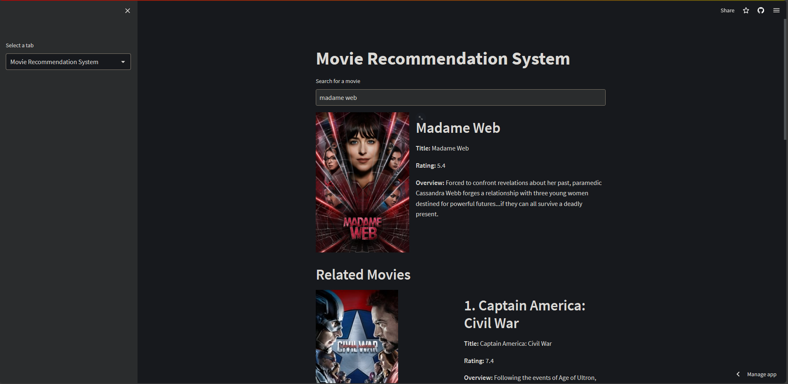

# Movie Recommendation System

Welcome to the Movie Recommendation System repository! This project utilizes the TMDB API, Streamlit, Python, and Natural Language Processing (NLP) techniques to provide personalized movie recommendations.



## Overview

This recommendation system leverages the power of the TMDB (The Movie Database) API to gather comprehensive information about movies. Using natural language processing techniques, it analyzes user input, preferences, and viewing history to generate tailored recommendations.

## Features

- **Personalized Recommendations:** Get movie recommendations based on your preferences and viewing history.
- **Interactive Interface:** The Streamlit interface offers a user-friendly experience for exploring and discovering new movies.
- **TMDB Integration:** Utilizes the TMDB API to fetch up-to-date information about movies, including ratings, genres, cast, and more.
- **NLP Powered:** Employs NLP techniques to understand user input and refine recommendations for a personalized movie-watching experience.

## How to Use

1. **Visit the App:** Click [here](https://samirsengupta-mrs-app-mgr2xx.streamlit.app/) to visit the Movie Recommendation System app.
   
2. **Enter Preferences:** Provide your movie preferences, such as genres, actors, directors, or specific movie titles.

3. **Explore Recommendations:** Receive personalized movie recommendations based on your input. You can explore details about each recommended movie, such as ratings, cast, and synopsis.

4. **Enjoy Watching:** Discover new movies to watch and enjoy a personalized movie-watching experience tailored to your tastes.

## Installation

To run this project locally, follow these steps:

1. Clone the repository:
   ```
   git clone https://github.com/SamirSengupta/MRS.git
   ```

2. Install dependencies:
   ```
   pip install -r requirements.txt
   ```

3. Run the Streamlit app:
   ```
   streamlit run app.py
   ```

## Feedback and Contributions

If you have any feedback, suggestions for improvement, or want to contribute to this project, feel free to open an issue or submit a pull request. Your contributions are highly appreciated!

## Author

This project is maintained by [Samir Sengupta](https://github.com/SamirSengupta).

Enjoy exploring and discovering new movies with the Movie Recommendation System!
